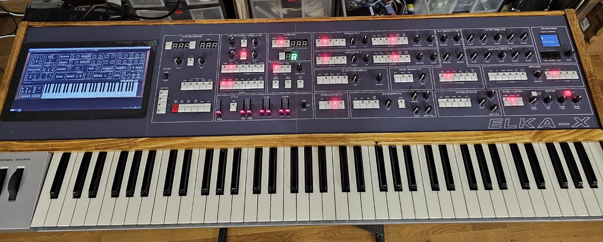

# VST hardware editor of the mythical or magical Elka Synthex (Elka-X) by Cherry Audio. 

I have tried to recreate the front panel of the Cherry Audio Elka-X VST to the best of my ability, I'm sure I can get at least 90% of the functions working, but how I handle some things such as the sequencer will have to be decided. Also setting the split position doesn't work yet.

A few quirks with the VST MIDI control, I thought that simply changing between layers would allow the same pot/button/slider to control either parameter on either layer depending which layer was selected. But Cherry Audio decided that each parameter would have an upper MIDI control and a lower MIDI control, so they could each independently edited with layer switching. MIDI CC messages have a range of 0-127 and several of them are reserved such as modulation and sustain and that leaves 125 available messages. If you count up the message requirements of the Synthex it is over 350 different MIDI messages. Obviously Cherry never thought anyone would be crazy enough to want to edit every parameter all at once.

So after reading the documents on CC messages for Cherry Audio products, it seems you can use the same CC message with different values between 0-127 to switch between a radio group (such as the OSC1 waveforms being 5 buttons in a group). You need to manipulate the Min and Max percentage knobs for each parameter and then you can switch between the buttons by varying the CC values. For example I set all the MIN values to 100% and then incremented the MAX values 10%, 20%, 30%, 40% and 50% for each button and then sending a CC value of 101, 69 or 101, 74 or 101, 82 or 101, 93 or 101, 117 allowed me to select each button in the radio group, effectively reducing the required MIDI messages from 5 to 1 for the OSC1 waveforms and because there are upper and lower sections it was effectively 10 MIDI messages reduced to 2. If I applied this technique across all the radio groups I could to reduce the MIDI message requirements. Any remaining non radio group buttons are switched using note on/off commands, starting at note 0 to around 22 that effectively uses the first 2 octaves of the 128 notes available and then starting at note 127 and working down I took another 2 octaves to give me 48 parameters I could switch on/off with notes. The Elka-X will no longer respond to these notes when mapped for parameters. 

I also created a MIDI to USB-HID Keyboard & Mouse interface, this effectively allows me to use keys A-Z and numbers 0-9 as extra controllers for buttons. I tested this and I have now mapped all the sequencer controls to the ASCII keys A-R.

# Things to do

Fix the split key position. (call logged with support).

Add Sequencer support

Decode the factory patches so they can be loaded into the SD card slot and used in the editor

Request NRPN support to all parameters. Asked CA many times for this.
