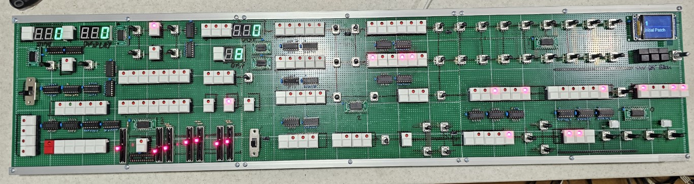

# VST hardware editor of the mythical or magical Elka Synth (Elka-X) by Cherry Audio. 

I have tried to recreate the front panel of the Cherry Audio Elka-X VST to the best of my ability, I'm sure I can get at least 90% of the functions working, but how I handle some things such as the Utility button and sequencewr will have to be decided.
